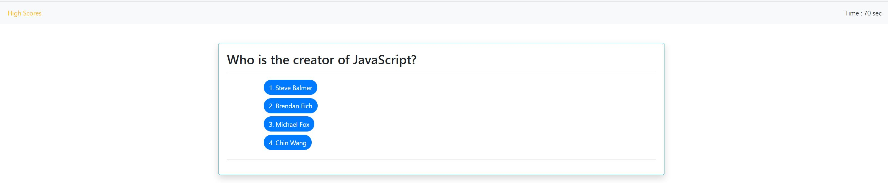

# JavaScript Quiz

In this assignment I created an instance of a user-defined object type to pull in questions and answers that could be manipulated by functions. 

## Table of Contents
  - [Day Planner](#javascript-quiz)
  - [Table of Contents](#table-of-contents)
  - [Description](#description)
  - [Technology](#technology)
  - [Business Context](#business-context)
  - [Demo](#demo)
  - [Contributors](#contributors)

## Methodoloy

One of the key things to note in this task was that all information had to be documented via JavaScript to avoid cheating. The HTML file conatain nothing other then 4 buttons and a couple of reference ID's and tags.

I broke the project up into 3 JavaScript files consisting of object prototypes and functions. This method allowed me to better organize the workflow of the application and challenged me to really understand function arguments and how they are passed.

## Technology 

### [HTML](https://www.w3schools.com/tags/tag_meta.asp): 
* Hypertext Markup Language (HTML) is the standard markup language for documents designed to be displayed in a web browser. It can be assisted by technologies such as Cascading Style Sheets (CSS) and scripting languages such as JavaScript.

### [Javascript](https://developer.mozilla.org/en-US/docs/Web/JavaScript) : 
* JavaScript is a cross-platform, object-oriented scripting language used to make webpages interactive.
* JavaScript(JS) is a lightweight, interpreted, or just-in-time compiled programming language with first-class functions. 
* With the HTML DOM, JavaScript can access and change all the elements of an HTML document.

### [CSS](https://www.w3schools.com/css/css_intro.asp) : 
*Stands for "Cascading Style Sheet." Cascading style sheets are used to format the layout of Web pages. They can be used to define text styles, table sizes, and other aspects of Web pages that previously could only be defined in a page's HTML.

## Screenshot  
|

## Contributor
* Brandon Johnson
* Repository: https://github.com/sheikb08/JavaScript-Test 
* Deployed App: https://sheikb08.github.io/JavaScript-Test/
